# Using Aanconda with FusionInsight HD

## Applicable Scenario

> Anaconda2-2019.03-Linux-x86_64  --> FusionInsight HD 6.5.0
>

## Overview

**Anaconda Distribution**

Anaconda Distribution is a free, easy-to-install package manager, environment manager and Python distribution with a collection of 1,000+ open source packages with free community support. Anaconda is platform-agnostic, so you can use it whether you are on Windows, macOS or Linux.

More about:[Anaconda](https://docs.anaconda.com/)

**FusionInsight HD**

FusionInsight HD is a distributed data processing system with enterprise-level big data processing capabilities, which provides large-capacity data storage, analysis and query & real-time streaming data processing and analysis.

More about:[FusionInsight HD](https://support.huawei.com/enterprise/zh/cloud-computing/fusioninsight-hd-pid-21110924?category=product-documentation/)


This document is just a starting guide for demonstrating using Ananconda with Fusioninsight HD through R and Python language.


## Physical Topology of Tested environment


  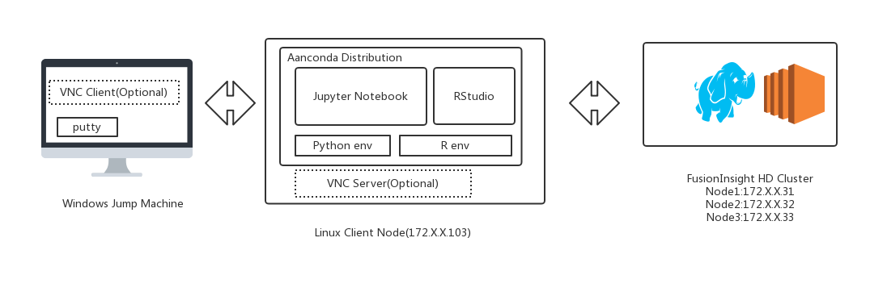

  Note:this is test env,the vnc server and vnc client are optional if working directly on GUI Client env.

## Software version(verified)
* Anaconda2-2019.03-Linux-x86_64
* FusionInsight HD 6.5.0
* Spark 2.3.2
* R version 3.5.1 (2018-07-02)
* RStudio 1.1.456
* Python 2.7.16 |Anaconda, Inc.| (default, Mar 14 2019, 21:00:58)
* Jypyter Notebook 5.7.8


## Different ways to use Anaconda with FusionInsight HD

(1) By using R Language

* RStudio user Interface

    * **Scenario 1: Submit the R script interactively in RStudio to the HD Spark cluster using sparklyr**

    Story:Data analysis of airline flight data using sparklyr and spark2x,final public online demo link http://rpubs.com/jinbnie/513252

    * **Scenario 2: Submit the R script interactively in RStudio to the HD Spark cluster using SparkR**

    Story:using SparkR to read the data in hive table
*	Jupyter Notebook User Interface

   * **Scenario 3: Submit the R script interactively in Jupyter Notebook to the HD Spark cluster using sparklyr**

     Story:Data analysis of airline flight data using sparklyr and spark2x

(2) By using Python Language
  * Jupyter Notebook User Interface

    * **Scenario 4: Submit the Python script interactively in Jupyter Notebook to the HD Spark cluster**

    Story:Performing a word count on text data in HDFS using Spark Python interface


##    Prerequisites
 * FusionInsight HD 6.5 env with develop user credential
 * linux Client Node having Root privileges
 * Internet network connection between windows jump machine,Linux client Node and HD cluster

## Test environment setup and software installation


**1. Install and Configure VNC Server on Linux Client Node(optionally if working directly on GUI Client env)**

Reference to [How to Install and Configure VNC Server on CentOS 7](https://github.com/jinbonie/Tips4Tools/blob/master/vnc/README.md)


 **2.Install Anaconda**

 Reference to https://docs.anaconda.com/anaconda/install/linux/

download the Anaconda installer for Linux.

```
wget https://repo.anaconda.com/archive/Anaconda2-2019.03-Linux-x86_64.sh
```
Enter the following to install Anaconda for Python 2.7:

`Note`
~/.bashrc will be modified after installing anaconda, some conda config will conflict with VNC server,so backup current bashrc file

```
cp ~/.bashrc ~/.bashrc.bak
bash Anaconda2-2019.03-Linux-x86_64.sh

```


1.	The installer prompts “In order to continue the installation process, please review the license agreement.” Click Enter to view license terms.
2.	Scroll to the bottom of the license terms and enter “Yes” to agree.
3.	The installer prompts you to click Enter to accept the default install location, CTRL-C to cancel the installation, or specify an alternate installation directory. If you accept the default install location, the installer displays “PREFIX=/home/{username}/anaconda<2 or 3>” and continues the installation. It may take a few minutes to complete.
Note:We recommend you accept the default install location. Do not choose the path as /usr for the Anaconda/Miniconda installation.
4.	The installer prompts “Do you wish the installer to initialize Anaconda2 by running conda init?” We recommend “yes”.

5.	The installer finishes and displays “Thank you for installing Anaconda<2 or 3>!”
6.	The installer provides a link to install PyCharm for Anaconda at https://www.anaconda.com/pycharm.
7.	Close and open your terminal window for the installation to take effect,
```
mv ~/.bashrc ~/.bashrc.anaconda
cp ~/.bashrc.bak ~/.bashrc
source ~/.bashrc.anaconda
```


**3.Creating an R environment and running RStudio**

Reference http://docs.anaconda.com/anaconda/navigator/tutorials/create-r-environment/


```
vi ~/.condarc
```
update bellow content to  ~/.condarc to accelarate conda package download speed

```
channels:
  - https://mirrors.ustc.edu.cn/anaconda/pkgs/main/
  - https://mirrors.ustc.edu.cn/anaconda/cloud/conda-forge/
  - https://mirrors.tuna.tsinghua.edu.cn/anaconda/pkgs/free/
  - defaults
show_channel_urls: true

```

start anaconda navigator

```
anaconda-navigator &
```

Create an New environments(named such as renv2)

Python :2.7

R:r

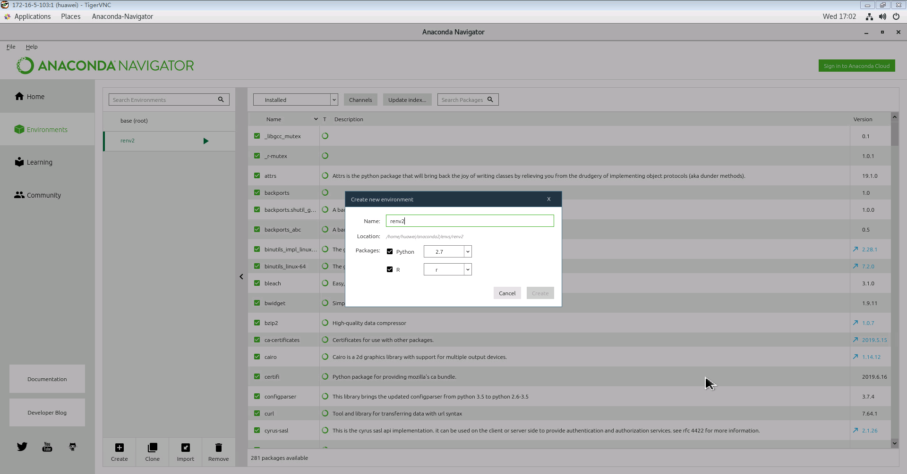

Go back to Home, and install rstudio


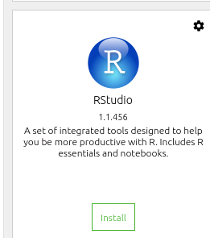


Starting RStudio
```
conda env list
conda activate renv2
rstudio &
```
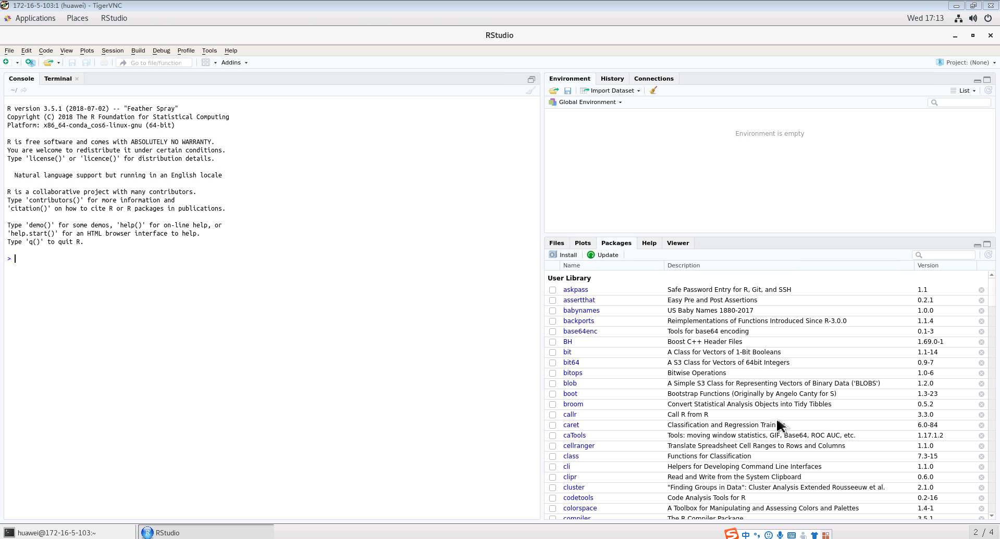


**4.Install FusionInsight HD Cluster Client**

Open browser,login to FusionInsight Mananger as developuser,then download the client

Note

To accelerate the download process, recommend download the client to tmp directory on one cluster node and then scp to Client Node.

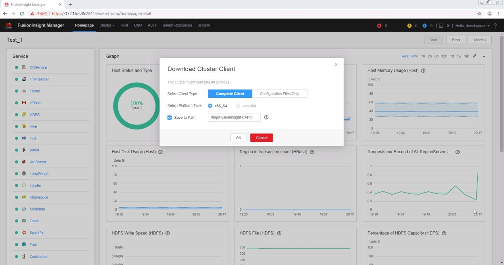

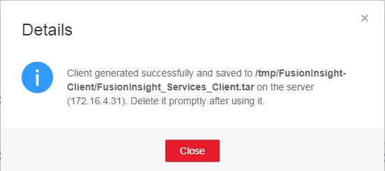

Login as root on Linux Client Node,run bellow command to install HD client

```
su – root
scp root@172.16.4.32:/tmp/FusionInsight-Client/FusionInsight_Services_Client.tar /opt/FusionInsight_Services_Client172.16.4.35.tar
tar xvf FusionInsight_Services_Client172.16.4.35.tar
tar xvf FusionInsight_Services_ClientConfig.tar
cd FusionInsight_Services_ClientConfig/
./install.sh /opt/client172.16.4.35/

```

add the client node ip and hostname mapping to all cluster nodes (fitest01,fitest02,fitest03),which helps making the Spark excutor driver node works outside the cluster node


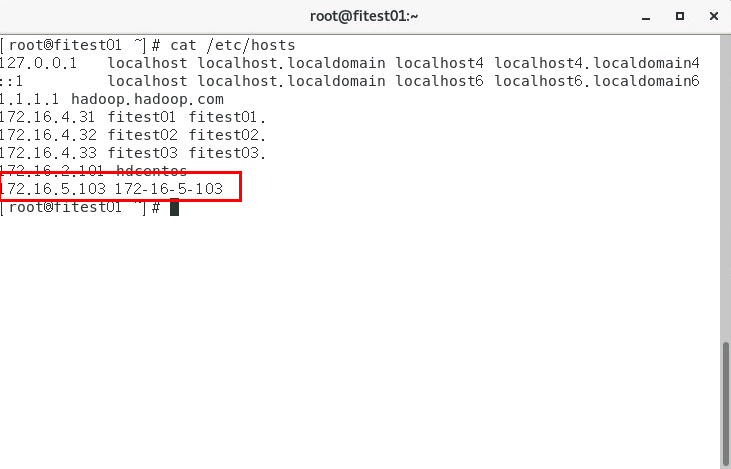

Start RStudio

```
su - huawei
cd /opt/client172.16.4.35/
source bigdata_env
kinit developuser
klist

source ~/.bashrc.anaconda
conda activate renv2
rstudio &

```

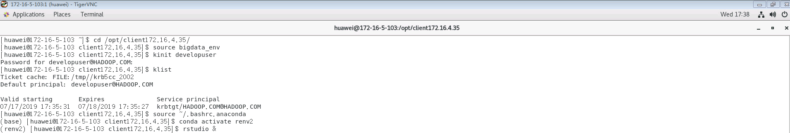


## Scenario 1: Submit the R script interactively in RStudio to the HD Spark cluster using sparklyr

Story:Data analysis of airline flight data using sparklyr and spark (Spark2x is required),final online demo link
http://rpubs.com/jinbnie/513252

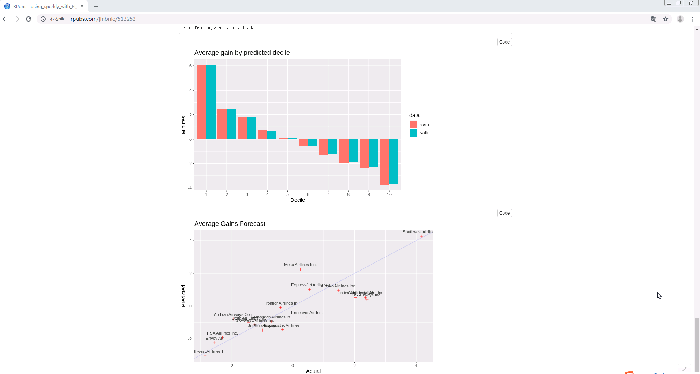


Note
Bellow 7 steps source codes are coming from existing [RStudio](https://fusioninsight.github.io/ecosystem/zh-hans/Integrated_Development_Environment/Using_RStudio_with_FusionInsight.html#%E4%BD%BF%E7%94%A8sparklyr%E7%BB%93%E5%90%88spark%E8%BF%9B%E8%A1%8C%E6%95%B0%E6%8D%AE%E5%88%86%E6%9E%90%E8%88%AA%E7%A9%BA%E5%85%AC%E5%8F%B8%E9%A3%9E%E8%A1%8C%E6%95%B0%E6%8D%AE%E5%BF%85%E9%A1%BB%E9%85%8D%E5%A5%97spark2x) example,with minimum code change in step 5,7 to work with FI HD 6.5(Spark 2.3.2).

**Step 1 install required packages**

```
install.packages("sparklyr")
install.packages("dplyr")
install.packages("ggplot2")
install.packages("babynames")
install.packages("dygraphs")
install.packages("rbokeh")

```

**Step 2 connect spark by using spark_connect**

```
library(sparklyr)
library(dplyr)
library(ggplot2)
options(bitmapType = 'cairo')
Sys.setenv(JAVA_HOME="/opt/client172.16.4.35/JDK/jdk-8u201")
Sys.setenv(SPARK_HOME="/opt/client172.16.4.35/Spark2x/spark")
spark_version_from_home(Sys.getenv("SPARK_HOME"))
Sys.setenv(SPARK_HOME_VERSION="2.3.2")
sc <- spark_connect(master =  "yarn-client", version = "2.3.2", spark_home = "/opt/client172.16.4.35/Spark2x/spark")

```


**Step 3 Cache the tables into memory**

```
#Use tbl_cache to load the flights table into memory. Caching tables will make analysis much faster. Create a dplyr reference to the Spark DataFrame.

# Cache flights Hive table into Spark
tbl_cache(sc, 'flights')
flights_tbl <- tbl(sc, 'flights')

# Cache airlines Hive table into Spark
tbl_cache(sc, 'airlines')
airlines_tbl <- tbl(sc, 'airlines')

# Cache airports Hive table into Spark
tbl_cache(sc, 'airports')
airports_tbl <- tbl(sc, 'airports')
```

**Step 4 Create a model data set**
```
#Filter the data to contain only the records to be used in the fitted model. Join carrier descriptions for reference. Create a new variable called gain which represents the amount of time gained (or lost) in flight.

# Filter records and create target variable 'gain'
model_data <- flights_tbl %>%
filter(!is.na(arrdelay) & !is.na(depdelay) & !is.na(distance)) %>%
filter(depdelay > 15 & depdelay < 240) %>%
filter(arrdelay > -60 & arrdelay < 360) %>%
filter(year >= 2003 & year <= 2007) %>%
left_join(airlines_tbl, by = c("uniquecarrier" = "code")) %>%
mutate(gain = depdelay - arrdelay) %>%
select(year, month, arrdelay, depdelay, distance, uniquecarrier, description, gain)

# Summarize data by carrier
model_data %>%
group_by(uniquecarrier) %>%
summarize(description = min(description), gain=mean(gain),
          distance=mean(distance), depdelay=mean(depdelay)) %>%
select(description, gain, distance, depdelay) %>%
arrange(gain)
```

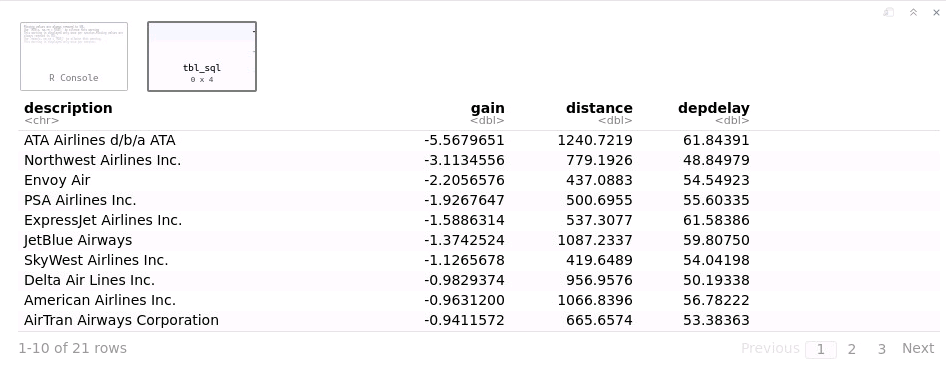

**Step 5 Train a linear model**
```
#Predict time gained or lost in flight as a function of distance, departure delay, and airline carrier.

# Partition the data into training and validation sets
model_partition <- model_data %>%
sdf_random_split(train = 0.8, valid = 0.2, seed = 5555)

# Fit a linear model
ml1 <- model_partition$train %>%
ml_linear_regression(gain ~ distance + depdelay + uniquecarrier)

# Summarize the linear model
summary(ml1)
```

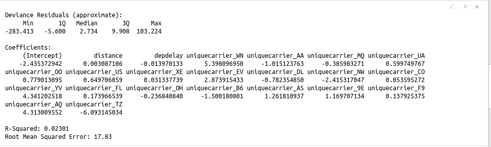


**Step 6 Assess model performance**
```
#Compare the model performance using the validation data.

# Calculate average gains by predicted decile
model_deciles <- lapply(model_partition, function(x) {
  ml_predict(ml1, x) %>%
    mutate(decile = ntile(desc(prediction), 10)) %>%
    group_by(decile) %>%
    summarize(gain = mean(gain)) %>%
    select(decile, gain) %>%
    collect()
})

# Create a summary dataset for plotting
deciles <- rbind(
  data.frame(data = 'train', model_deciles$train),
  data.frame(data = 'valid', model_deciles$valid),
  make.row.names = FALSE
)

# Plot average gains by predicted decile
deciles %>%
  ggplot(aes(factor(decile), gain, fill = data)) +
  geom_bar(stat = 'identity', position = 'dodge') +
  labs(title = 'Average gain by predicted decile', x = 'Decile', y = 'Minutes')

```

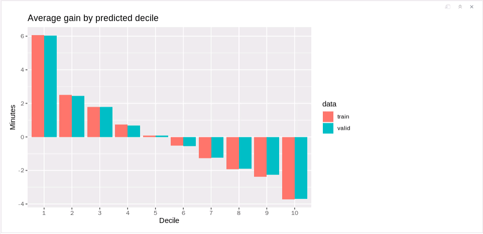


**Step 7  Visualize predictions**
```
#Compare actual gains to predicted gains for an out of time sample.

# Select data from an out of time sample
data_2008 <- flights_tbl %>%
  filter(!is.na(arrdelay) & !is.na(depdelay) & !is.na(distance)) %>%
  filter(depdelay > 15 & depdelay < 240) %>%
  filter(arrdelay > -60 & arrdelay < 360) %>%
  filter(year == 2008) %>%
  left_join(airlines_tbl, by = c("uniquecarrier" = "code")) %>%
  mutate(gain = depdelay - arrdelay) %>%
  select(year, month, arrdelay, depdelay, distance, uniquecarrier, description, gain, origin,dest)

# Summarize data by carrier
carrier <- ml_predict(ml1, data_2008) %>%
  group_by(description) %>%
  summarize(gain = mean(gain), prediction = mean(prediction), freq = n()) %>%
  filter(freq > 10000) %>%
  collect

# Plot actual gains and predicted gains by airline carrier
ggplot(carrier, aes(gain, prediction)) +
  geom_point(alpha = 0.75, color = 'red', shape = 3) +
  geom_abline(intercept = 0, slope = 1, alpha = 0.15, color = 'blue') +
  geom_text(aes(label = substr(description, 1, 20)), size = 3, alpha = 0.75, vjust = -1) +
  labs(title='Average Gains Forecast', x = 'Actual', y = 'Predicted')
```
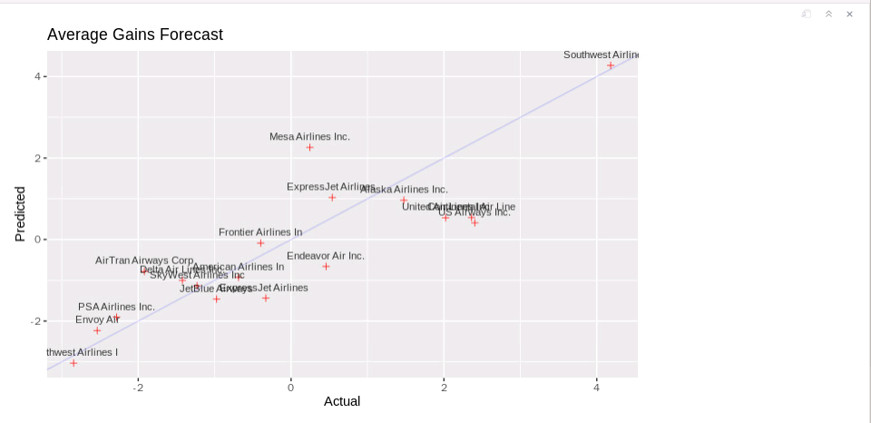


## Scenario 2: Submit the R script interactively in RStudio to the HD Spark cluster using SparkR

Story:using SparkR reading the hive table data in Scenario 1

run bellow commands to start RStudio
```
cd /opt/client172.16.4.35/
source ~/.bashrc.anaconda
conda activate renv2
source bigdata_env
kinit developuser
klist
rstudio &

```
run bellow R code in RStudio

```
if (nchar(Sys.getenv("SPARK_HOME")) < 1) {
  Sys.setenv(SPARK_HOME="/opt/client172.16.4.35/Spark2x/spark")
}
library(SparkR, lib.loc = c(file.path(Sys.getenv("SPARK_HOME"), "R", "lib")))
sparkR.session(master = "yarn", sparkConfig = list(spark.driver.memory = "2g"),(spark.submit.deployMode="client"))

results <- sql("FROM airports SELECT id, name ")
head(results)
```

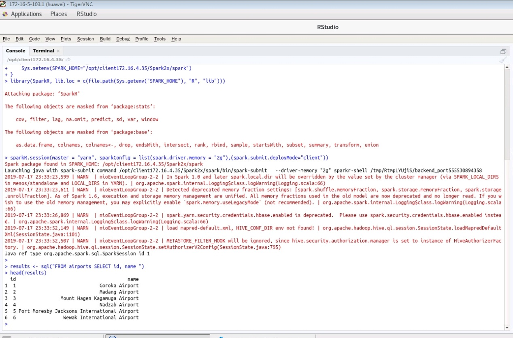

## Scenario 3: Submit the R script interactively in Jupyter Notebook to the HD Spark cluster using sparklyr

**step 1:Lunch Jupyter Notebook**

```
cd /opt/client172.16.4.35/
source bigdata_env
kinit developuser
source ~/.bashrc.anaconda
conda env list
conda activate renv2
sudo chmod -R 777 /opt/client172.16.4.35
jupyter-notebook &

```

**step 2:New R Notebook**

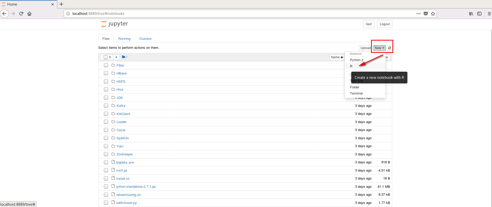

**step 3:submit each step code in Scenario 1 interactively in Jupyter Notebook**

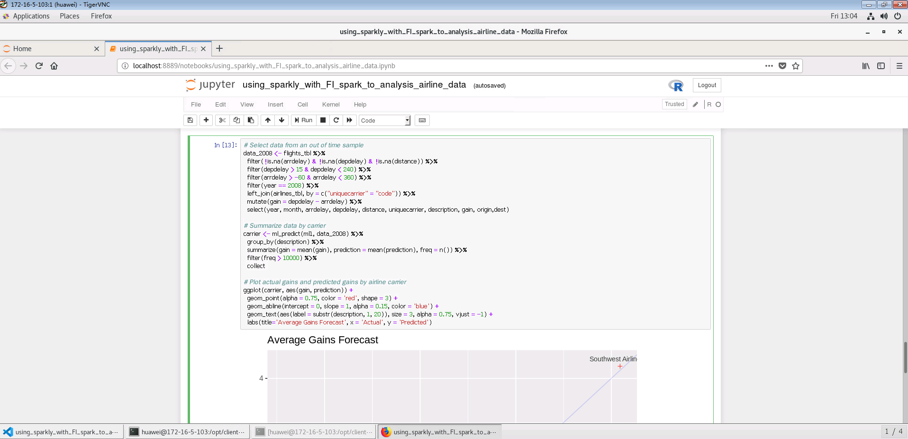


## Scenario 4: Submit the Python script interactively in Jupyter Notebook to the HD Spark cluster

Story:Performing a word count on text data in HDFS using Spark Python interface

**step 1:Start PySpark**

```
cd /opt/client172.16.4.35/
source bigdata_env
kinit developuser
klist
source ~/.bashrc.anaconda
export PYSPARK_DRIVER_PYTHON="ipython"
export PYSPARK_DRIVER_PYTHON_OPTS="notebook"
pyspark --master yarn --deploy-mode client &

```

**step 2:New Python Notebook**

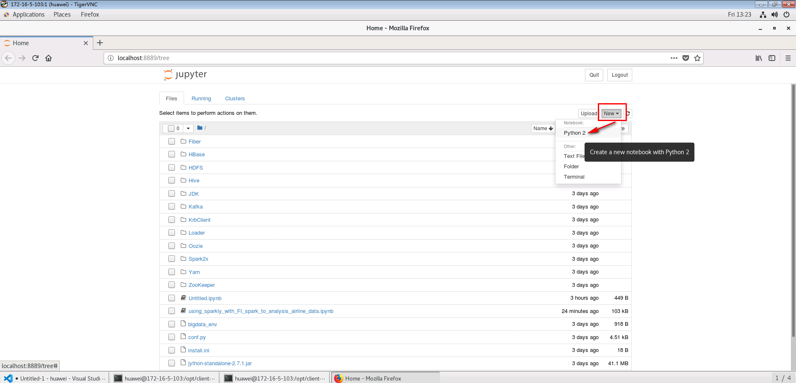

**step3:Submit bellow Python script interactively in Jupyter Notebook**

```
# spark-wordcount.py
from pyspark import SparkConf
from pyspark import SparkContext
conf = SparkConf()
conf.setAppName('spark-wordcount_from172.16.5.103')
sc = SparkContext(conf=conf)
distFile = sc.textFile('hdfs://hacluster/user/developuser/airlines.csv')
nonempty_lines = distFile.filter(lambda x: len(x) > 0)
print 'Nonempty lines', nonempty_lines.count()
words = nonempty_lines.flatMap(lambda x: x.split(' '))
wordcounts = words.map(lambda x: (x, 1)) \
                  .reduceByKey(lambda x, y: x+y) \
                  .map(lambda x: (x[1], x[0])).sortByKey(False)
print 'Top 100 words:'
print wordcounts.take(100)

```
The result:
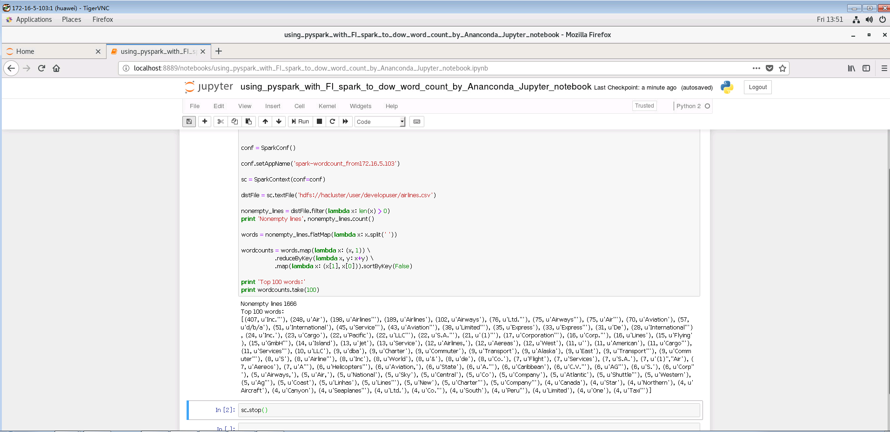


## FAQ
**Q1:How can I get the source data demonstrated in this article using sparklyr**

Answer:
https://fusioninsight.github.io/ecosystem/zh-hans/Integrated_Development_Environment/Using_RStudio_with_FusionInsight.html#%E5%A6%82%E4%BD%95%E8%8E%B7%E5%8F%96%E6%9C%AC%E6%96%87%E4%B8%AD%E4%BD%BF%E7%94%A8sparklyr%E5%88%86%E6%9E%90%E7%9A%84%E6%BA%90%E6%95%B0%E6%8D%AE
