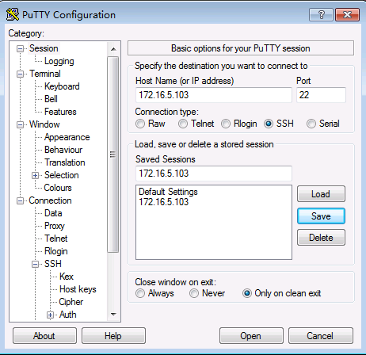

## Overview
Sometime, we need a GUI env on linux server while working on Windows client remotely, we can us VNC to do the projection of the GUI interface from linux server to client windows machine.

  

What will do
1.	Update CentOS System and Create a Linux User (such as Huawei)
2.	Install Gnome Desktop and TigerVNC
3.	Initial VNC Configuration.
4.	Configure TigerVNC.
5.	Run TigerVNC as a Service.
6.	Connect to the VNC Server Through SSH Tunnel.

## 1. Install and Configure VNC Server

Reference : [How to Install and Configure VNC Server on CentOS 7](https://vitux.com/centos-vnc-server/)


On the Linux client Node

**Step 1 – Update CentOS and add a Linux User**
```
su -
yum update -y
useradd -m -s /bin/bash huawei
passwd huawei
usermod -a -G wheel huawei
su – huawei
sudo su

```
**Step 2 – Install Gnome Desktop and TigerVNC(optionally if have done when installing the OS)**
```
yum -y install epel-release
yum groupinstall “GNOME Desktop” -y
yum -y install tigervnc-server tigervnc-server-minimal
```
Wait until the installation is complete.
The GNOME Desktop desktop with TigerVNC has been installed.

**Step 3 – Initial VNC Configuration**
```
su – huawei
vncserver
ls -lah ~/.vnc/
vncserver -list

```

**Step 4 – Configure TigerVNC**

```
vncserver -kill :1
chmod +x ~/.vnc/xstartup
vncserver
vncserver -list
```
**Step 5 – Running TigerVNC as a Service**
```
cd /etc/systemd/system
vi vncserver@.service
```
Paste the following configuration there.

```
[Unit]
 Description=Remote desktop service (VNC)
 After=syslog.target network.target

 [Service]
 Type=forking
 User=huawei
 PIDFile=/home/huawei/.vnc/%H:%i.pid
 ExecStartPre=-/usr/bin/vncserver -kill :%i > /dev/null 2>&1
 ExecStart=/usr/bin/vncserver -depth 24 -geometry 1280x800 :%i
 ExecStop=/usr/bin/vncserver -kill :%i

 [Install]
 WantedBy=multi-user.target

```

Save the file and exit vim.
Now reload systemd and start the VNC server service.


```
systemctl enable vncserver@1.service
systemctl status vncserver@1.service

```

The VNC Server installation and configuration has been completed.

## 2.Connect to the VNC Server Through SSH Tunnel

On the windows jump machine,first install [putty](https://www.chiark.greenend.org.uk/~sgtatham/putty/latest.html) and [TigerVNC](https://bintray.com/tigervnc/stable/download_file?file_path=tigervnc-1.9.0.exe)

open putty,connect to Linux Client Node IP

  

Connection->Data

Auto-login usename:huawei

  

Connection ->SSh->Auth->Tunnels

Source port :5903

Destination:172.16.5.103:5901


  

Add and come back to Session,


  

Save Sessions as 172.16.5.103

  

Open this sesion and keep it open

  

Start TigerVNC

VNC server:localhost:3

  

Enter the Password for the vnc


  

The Gnome Destop on TigerVNC

  
